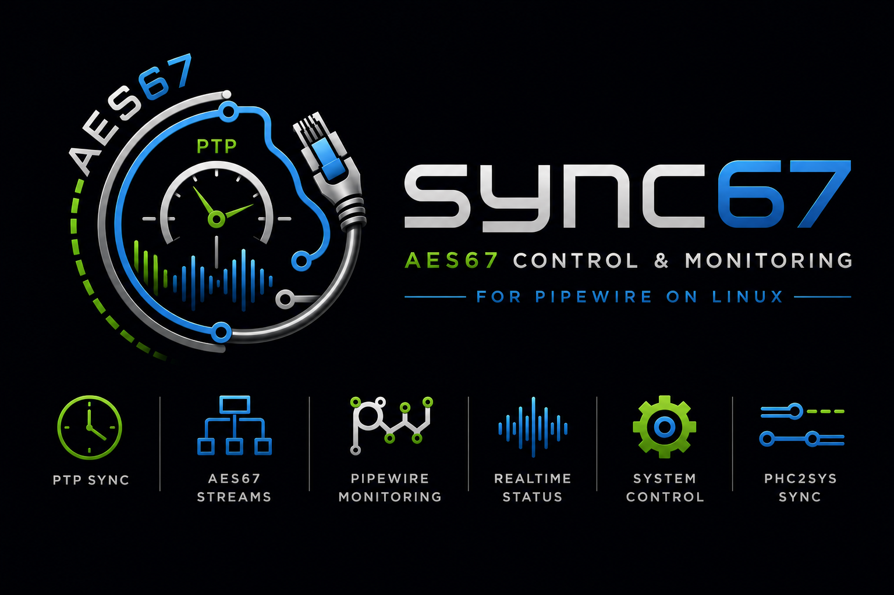
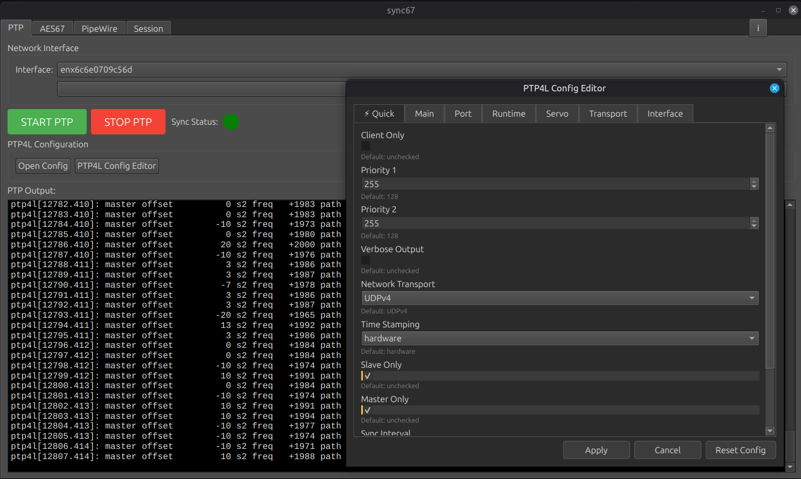
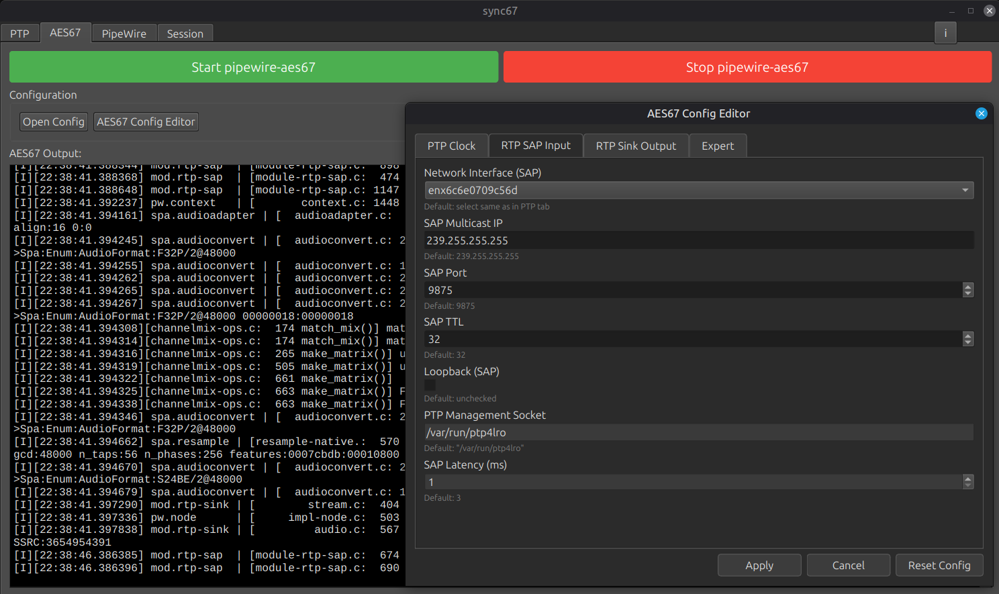
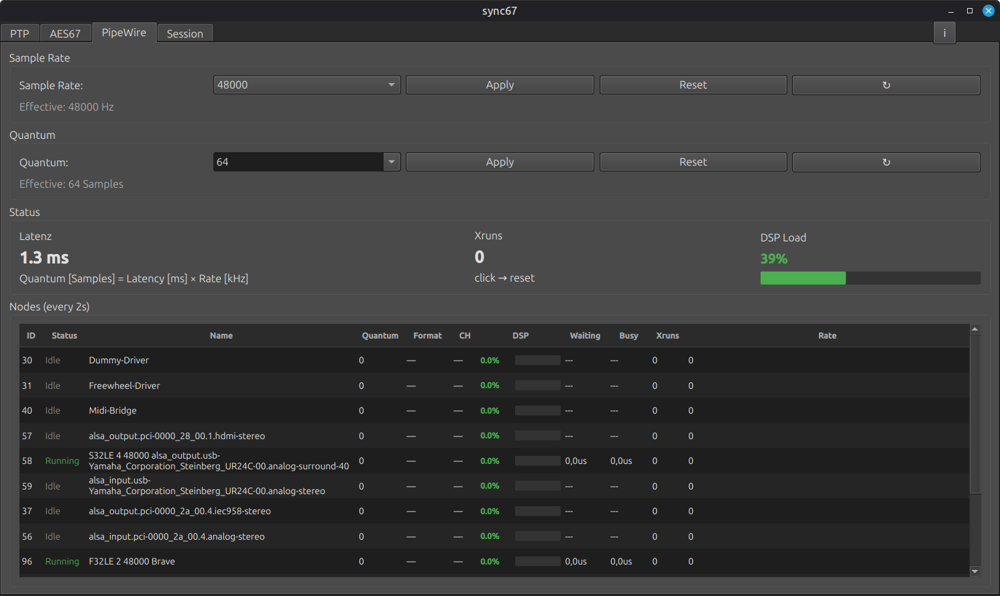
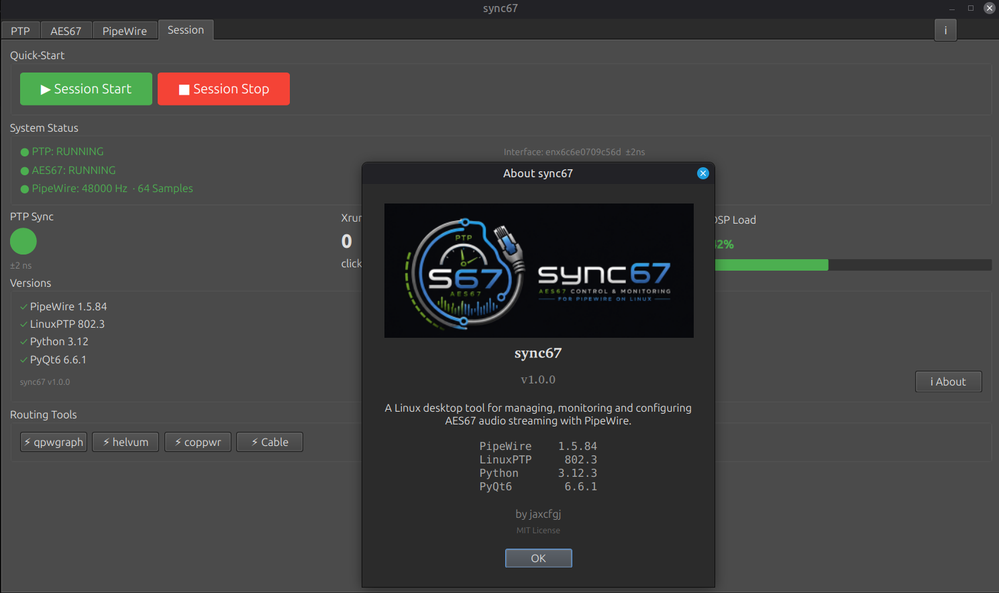

# sync67

A Linux desktop AOIP tool for managing, monitoring and configuring **AES67 audio streaming** with **PipeWire**.

> **sync67 does NOT replace patchbay tools** like qpwgraph, helvum or coppwr.
> Those are used alongside sync67 for audio routing and patching.

---

## Features

### PTP Tab


- Network interface selection (via `ip link show`)
- ptp4l start/stop with live terminal output
- Sync status indicator (traffic light: green ≤200ns, yellow ≤1000ns, red)
- ethtool/ip link optimization settings (gro, gso, tso, sg, rx-usecs, multicast)
- **PTP4L Config Editor**: full GUI editor for `/etc/linuxptp/ptp4l.conf`
  - 119 parameters across 7 tabs (Quick, Default, Port, Runtime, Servo, Transport, Interface)
  - Quick tab with 10 essential parameters
  - Format-preserving parser, Reset Config button
  - Deviation highlighting, tooltips, dark theme
  - **Auto-detection** of supported parameters via `strings /usr/sbin/ptp4l`
    → unsupported parameters greyed out with `(unsupported)` label
  - `🔮 Other` tab for unknown binary parameters

### AES67 Tab


- pipewire-aes67 start/stop with live terminal output
  - Optional verbose mode (`-v` flag toggle)
- Open config file in external editor
- **AES67 Config Editor**: full GUI editor for `pipewire-aes67.conf`
  - 40 parameters across 4 tabs (PTP Clock, RTP SAP Input, RTP Sink Output, Expert)
  - Format-preserving SPA parser (comments and formatting preserved)
  - RTP Sink multi-instance support (add/remove)
  - System Clock checkbox (bypasses PHC timestamp-0 issue when running as root)
  - Deviation highlighting when value differs from default
  - **Inline comment handling**: `#` and `;` comments in SPA config values are properly stripped
  - stream.rules raw editor in Expert tab
  - Dark theme

### PipeWire Tab


- Sample Rate control (48000, 96000, 192000) with Apply/Reset/Refresh
- Quantum control (16-8192, editable) with Apply/Reset/Refresh
  - Uses `clock.force-rate` / `clock.force-quantum` for immediate node effect
- Effective value display from `pw-top` when metadata is default
- Latency display (calculated from Quantum × Sample Rate)
- Xruns counter (click to reset)
- DSP Load with colored progress bar (green/yellow/red)
- **Node table** with tree structure (parent-child via `└─`)
  - Columns: ID, Status (Running/Idle/Closed), Name, Quantum, Format, CH, DSP, Waiting, Busy, Xruns, Rate
  - Read-only, column widths remembered via QSettings
  - Updates every 2s via `pw-top` (second iteration for effective Running states)

### Session Tab


- **Quick-Start**: Start ptp4l + pipewire-aes67 in the correct order with one button
  - Start sequence: ptp4l → 2s delay → pipewire-aes67
  - Stop sequence: aes67 → ptp4l
- **System Status**: overview of PTP, AES67, and PipeWire at a glance
- PTP Sync traffic light + offset display
- Xruns counter + DSP load bar (from PipeWire tab)
- **Versions block**: PipeWire, LinuxPTP, Python, PyQt6 (installed/missing)
- **Routing Tools**: buttons to launch qpwgraph, helvum, coppwr (native + Flatpak detection)
- **About dialog**: version info, author, license, technology stack

---

## Requirements

| Component | Usage |
|---|---|
| Python 3 | Runtime |
| PyQt6 | GUI Framework |
| PipeWire | Audio backend (with pipewire-aes67, pw-top, pw-metadata, pw-cli) |
| LinuxPTP (ptp4l) | PTP clock synchronization |
| qpwgraph / helvum / coppwr | Optional – external routing/patchbay tools |

---

## Installation

**1. Clone the repository**
```bash
git clone https://github.com/jayxcfgj/sync67.git
```

**2. Enter the directory**
```bash
cd sync67
```

**3. Install dependencies**

*Debian / Ubuntu / Linux Mint:*
```bash
sudo apt install python3-pyqt6 linuxptp
```

*Arch Linux:*
```bash
sudo pacman -S python-pyqt6 linuxptp
```

*Fedora:*
```bash
sudo dnf install python3-qt6 linuxptp
```

> **PipeWire:** Required – already installed on most systems.
> If missing, install via your package manager (`pipewire` package)
> or compile from [source](https://pipewire.org) for the latest version
> (recommended for AES67).

**4. Run (requires root)**
```bash
sudo python3 main.py
```

---

## License

MIT License

Copyright 2026 jaxcfgj

Permission is hereby granted, free of charge, to any person obtaining a copy
of this software and associated documentation files (the "Software"), to deal
in the Software without restriction, including without limitation the rights
to use, copy, modify, merge, publish, distribute, sublicense, and/or sell
copies of the Software, and to permit persons to whom the Software is
furnished to do so, subject to the following conditions:

The above copyright notice and this permission notice shall be included in all
copies or substantial portions of the Software.

THE SOFTWARE IS PROVIDED "AS IS", WITHOUT WARRANTY OF ANY KIND, EXPRESS OR
IMPLIED, INCLUDING BUT NOT LIMITED TO THE WARRANTIES OF MERCHANTABILITY,
FITNESS FOR A PARTICULAR PURPOSE AND NONINFRINGEMENT. IN NO EVENT SHALL THE
AUTHORS OR COPYRIGHT HOLDERS BE LIABLE FOR ANY CLAIM, DAMAGES OR OTHER
LIABILITY, WHETHER IN AN ACTION OF CONTRACT, TORT OR OTHERWISE, ARISING FROM,
OUT OF OR IN CONNECTION WITH THE SOFTWARE OR THE USE OR OTHER DEALINGS IN THE
SOFTWARE.

---

## Name

**sync67** stands for:

- AES**67**
- **Sync**hronization
- PTP Clocking
- Realtime Audio Networking

## Nodes

The app was made with heavy usage of various LLMs.